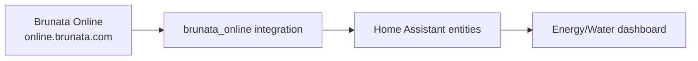
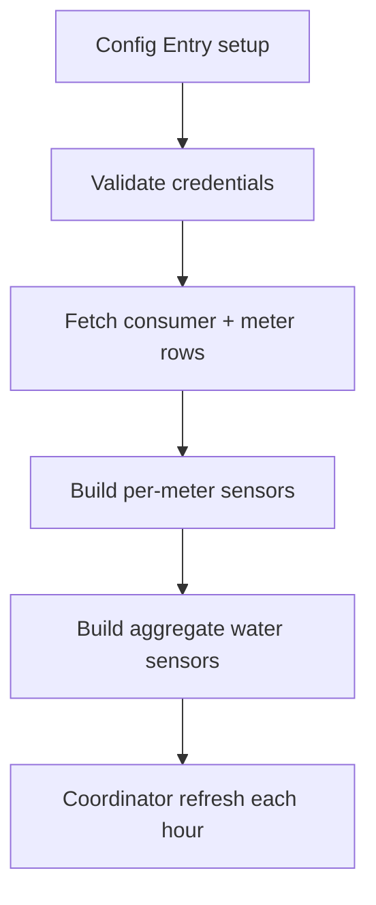
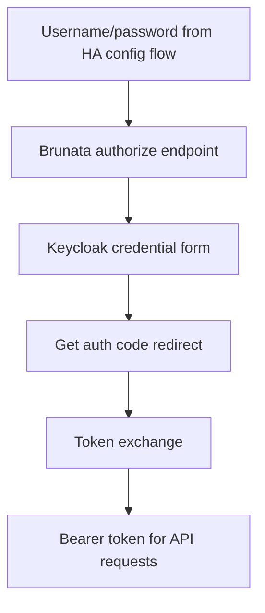
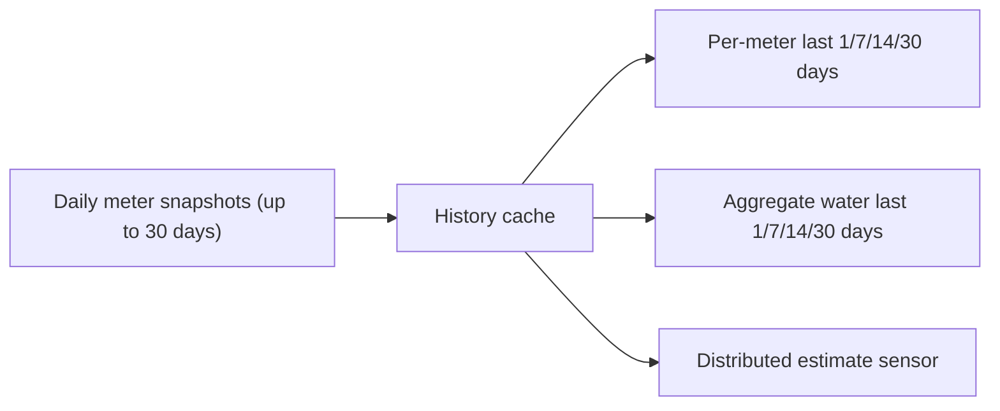

# brunata-to-home-assistant

> [!WARNING]
> We are aware that there are issues in the codebase.
> This is a hobby project maintained in spare time.
> Fixes and improvements are implemented when time allows.
> Do not deploy in production without proper validation.

`brunata_online` is a Home Assistant custom integration that authenticates against Brunata Online and creates water/heating meter sensors from `online.brunata.com`.

---

> [!IMPORTANT]
> Home Assistant should be treated as the Source of Truth for automations and dashboards.
> This integration is read-only and only syncs data from Brunata to Home Assistant.

---

## Visual Overview




---

## Architecture & Internal Flow

### Runtime Execution Flow



---

### Authentication Flow



---

### History + Windowed Consumption



---

## Features

- Config-flow setup in Home Assistant UI (no YAML config required)
- Per-meter sensors for water and heating
- Per-meter rolling consumption sensors:
  - Water: last `1`, `7`, `14`, `30` days
  - Heating: last `30` days
- Aggregate water sensors for Energy dashboard:
  - `sensor.brunata_water_total`
  - `sensor.brunata_cold_water_total`
  - `sensor.brunata_hot_water_total`
- Aggregate water rolling sensors:
  - `... last 1 day`, `... last 7 days`, `... last 14 days`, `... last 30 days`
- Includes serial number and meter metadata in sensor attributes

> [!NOTE]
> Sync direction is strictly one-way: Brunata -> Home Assistant.
> No write operations are performed against Brunata meters.

---

## Quick Start

### 1. Install with HACS

1. Open **HACS** in Home Assistant.
2. Go to **Integrations**.
3. Click menu (three dots) -> **Custom repositories**.
4. Add repository URL:
   - `https://github.com/patricklind/brunata-to-home-assistant`
5. Select category: **Integration**.
6. Install **Brunata Online**.
7. Restart Home Assistant.

---

### 2. Add integration

1. Go to **Settings** -> **Devices & Services**.
2. Click **Add Integration**.
3. Search for **Brunata Online**.
4. Enter Brunata username/email and password.

---

### 3. Add water totals to Energy dashboard

In Home Assistant:

`Settings -> Dashboards -> Energy -> Water`

Use one of:

- `sensor.brunata_water_total` (all water meters)
- `sensor.brunata_cold_water_total`
- `sensor.brunata_hot_water_total`

> [!IMPORTANT]
> Use the `..._total` sensors for Energy/Water.
> `last N days` sensors are period deltas for cards/analysis, not cumulative meters.

---

## Connectivity Requirements

Home Assistant must be able to reach:

- `https://online.brunata.com`

> [!CAUTION]
> If logins fail with timeout from Home Assistant but work from browser, verify host networking/MTU.
> MTU `1500` has been required in multiple environments.

---

## Local Debug Script

This repo includes a standalone script to test login and data retrieval:

```bash
python3 fetch_brunata_data.py
```

Environment variables (from `.env`):

- `BRUNATA_USERNAME`
- `BRUNATA_PASSWORD`

Copy `.env.example` to `.env` and replace the placeholders. The ignored `.env`
file and generated `output/` directory can contain credentials or personal meter
data and must not be committed or shared.

Output files:

- `output/brunata_data.json`
- `output/brunata_meters.csv`

## Development and verification

The integration has no database, server process, or standalone web UI. Home
Assistant supplies the async HTTP session, scheduling, entity registry, storage,
and UI. The only direct runtime dependency in this repository is for the optional
diagnostic script; Home Assistant installs the integration requirement declared
in `manifest.json`.

Use Python 3.12 or newer (matching current supported Home Assistant releases):

```bash
python -m pip install -r requirements.txt
python -m unittest discover -s tests -v
python -m compileall -q custom_components fetch_brunata_data.py tests
```

Maintainer checks mirror CI:

```bash
python -m pip install pre-commit black flake8
pre-commit run --config .github/pre-commit.yml --all-files
```

Live authentication and meter retrieval require a real Brunata account and
outbound access to `https://online.brunata.com`; unit tests do not make network
requests.

---

## Troubleshooting

1. **Cannot connect / timeout**

   - Confirm DNS and outbound HTTPS from Home Assistant host/container.
   - Test:
     - `curl -I https://online.brunata.com`

2. **Credentials rejected in HA, but browser works**

   - Usually network/timeouts from HA host, not wrong credentials.
   - Check Home Assistant logs for `TimeoutError` / `ReadTimeout`.

3. **No history/last N days values**
   - Integration needs sufficient daily points.
   - First refresh may expose empty `last N days` until history cache is filled.

4. **A water transmitter was replaced**
   - Brunata may stop returning a current value for the old transmitter while
     the new transmitter reports only consumption since the exchange.
   - The total sensors retain the old transmitter's latest historical reading
     as the baseline and add the replacement transmitter's reading.

---

## Maintainer: Tag + Release

1. Bump version in:
   - `custom_components/brunata_online/manifest.json`
2. Commit and push `main`.
3. Create tag:
   - `git tag vX.Y.Z` (the tag must be `v` followed by the manifest version)
   - `git push origin vX.Y.Z`
4. Workflow `Release from tag` publishes GitHub Release automatically.

The workflow rejects a tag that does not match the version in the integration
manifest, preventing the Releases and Tags pages from advertising different
versions.

> [!CAUTION]
> If tags are pushed from HTTPS token without `workflow` scope, workflow-file changes may be rejected.
