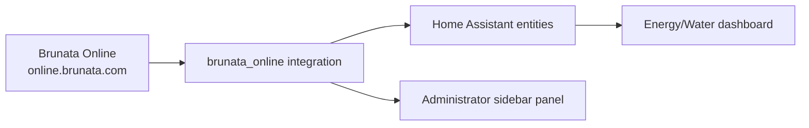
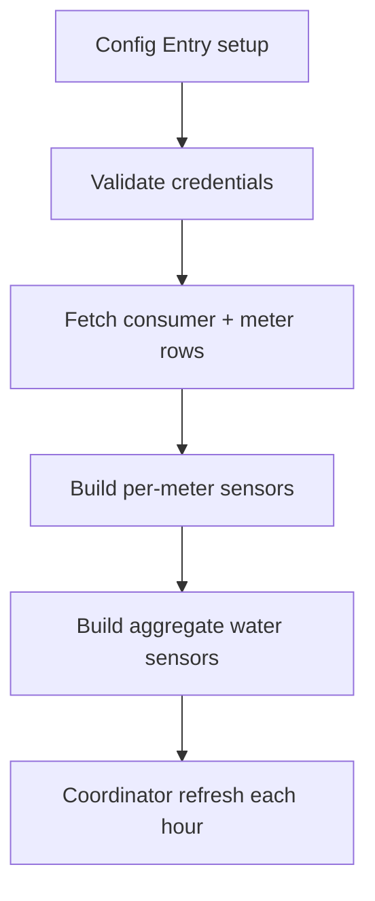
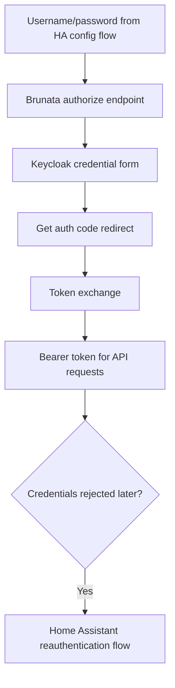
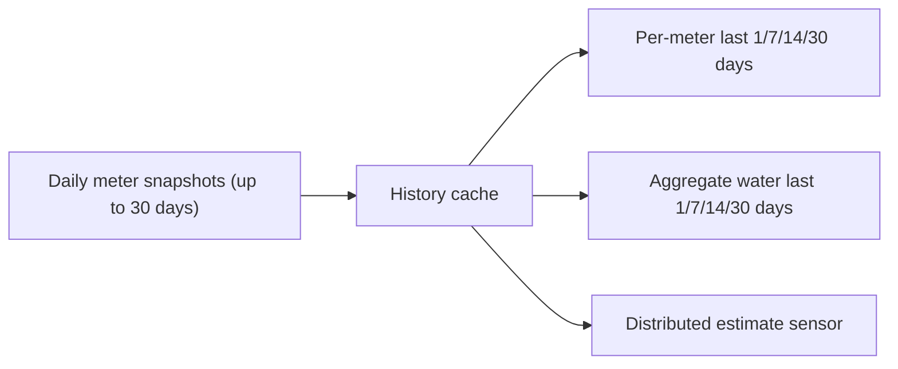

# brunata-to-home-assistant

> [!IMPORTANT]
>
> **Reporting a bug:** Before opening a [GitHub issue](https://github.com/patricklind/brunata-to-home-assistant/issues), update to the latest release and include:
>
> - the Brunata Online integration version and Home Assistant version;
> - a clear description of the expected and actual result;
> - the affected meter type and the relevant dates/values shown by Brunata and Home Assistant;
> - steps to reproduce the problem;
> - relevant debug logs; and
> - the diagnostics file from **Settings → Devices & services → Brunata Online → three-dot menu → Download diagnostics**.
>
> Never post your password, access token, cookies, or unredacted personal information. The integration diagnostics exclude credentials, consumer details, placement, serial numbers, and raw meter IDs, but retain reading values and dates needed for troubleshooting.

> [!WARNING]
> We are aware that there are issues in the codebase.
> This is a hobby project maintained in spare time.
> Fixes and improvements are implemented when time allows.
> Do not deploy in production without proper validation.

`brunata_online` is a Home Assistant custom integration that authenticates against Brunata Online and creates water/heating meter sensors from `online.brunata.com`.

Current integration release: **v1.0.36**. The integration declares Home
Assistant **2024.6.0 or newer** as its minimum supported version.

---

> [!IMPORTANT]
> Home Assistant should be treated as the Source of Truth for automations and dashboards.
> This integration is read-only and only syncs data from Brunata to Home Assistant.

---

## Visual Overview




---

## Architecture & Internal Flow

### Runtime Execution Flow



---

### Authentication Flow



---

### History + Windowed Consumption



---

## Features

- Config-flow setup in Home Assistant UI (no YAML config required)
- Home Assistant reauthentication flow when Brunata rejects stored credentials
- Per-meter sensors for water and heating
- Administrator-only sidebar panel for readings, history, costs, and display settings
- Per-meter rolling consumption sensors:
  - Water: last `1`, `7`, `14`, `30` days
  - Heating: last `30` days
- Aggregate water sensors for Energy dashboard:
  - `sensor.brunata_water_total`
  - `sensor.brunata_cold_water_total`
  - `sensor.brunata_hot_water_total`
- Aggregate water rolling sensors:
  - `... last 1 day`, `... last 7 days`, `... last 14 days`, `... last 30 days`
- Includes serial number and meter metadata in sensor attributes
- English-first panel text with Home Assistant localization and support for all
  64 languages currently exposed by Home Assistant
- Right-to-left layout for Arabic, Persian, Hebrew, and Urdu

> [!NOTE]
> Sync direction is strictly one-way: Brunata -> Home Assistant.
> No write operations are performed against Brunata meters.

---

## Quick Start

### 1. Install with HACS

1. Open **HACS** in Home Assistant.
2. Go to **Integrations**.
3. Click menu (three dots) -> **Custom repositories**.
4. Add repository URL:
   - `https://github.com/patricklind/brunata-to-home-assistant`
5. Select category: **Integration**.
6. Install **Brunata Online**.
7. Restart Home Assistant.

---

### 2. Add integration

1. Go to **Settings** -> **Devices & Services**.
2. Click **Add Integration**.
3. Search for **Brunata Online**.
4. Enter Brunata username/email and password.

The **Brunata** sidebar panel is shown to Home Assistant administrators. Its
period, precision, currency, and unit-price settings are stored by Home
Assistant and shared across browsers and devices; they do not change sensor
data or Brunata readings.

### Sidebar panel

The panel contains five views:

- **Overview** — period consumption grouped by compatible medium and unit,
  recent readings, and compact history charts.
- **Consumption** — one chart and period delta per meter.
- **Devices** — meter placement, medium, number, current value, and unit.
- **Settings** — Home Assistant-synchronized display and price preferences.

The development version adds a **Reports** view with week/month/year comparison,
monthly budgets, CSV download, and explicit “not enough history” feedback. The
Consumption view also supports 7/14/30-day zoom and optional from/to dates.

Panel data include private meter information, so both the sidebar route and its
WebSocket data command require a Home Assistant administrator account.

### Panel settings

| Setting           | Supported values           | Default | Notes                                              |
| ----------------- | -------------------------- | ------- | -------------------------------------------------- |
| Period            | 7 or 30 days               | 30 days | Uses calendar dates, not a fixed number of samples |
| Display precision | 0–3 decimals               | 2       | Applies only to panel formatting                   |
| Currency          | Three-letter code          | EUR     | Used for estimated costs                           |
| Water price       | Non-negative price per m³  | 0       | Applies to cold and hot water measured in m³       |
| Heating price     | Non-negative price per kWh | 0       | Never applied to radiator allocation units         |
| Water budget      | Non-negative m³ per month  | 0       | Zero disables budget progress                      |
| Heating budget    | Non-negative kWh per month | 0       | Only applies to physical kWh meters                |
| Report period     | Week, month, or year       | Week    | Requires two complete periods of history           |
| Chart range       | 7, 14, or 30 days          | 30 days | Can be narrowed further with from/to dates         |

Settings are validated and stored in Home Assistant's integration storage.
Because the panel and settings command are administrator-only, an administrator
must save changes. Existing browser-local settings from earlier releases are
migrated once when the panel first loads. A price of `0` hides the corresponding
cost estimate. Panel estimates are informational and must not be used as billing
data.

### Language behavior

The panel first asks Home Assistant for its own translated UI strings. English
is the canonical fallback when Home Assistant does not expose a suitable key.
Medium names are included for every language currently supported by Home
Assistant, and regional locales fall back to their base language where needed.

---

### 3. Add water totals to Energy dashboard

In Home Assistant:

`Settings -> Dashboards -> Energy -> Water`

Use one of:

- `sensor.brunata_water_total` (all water meters)
- `sensor.brunata_cold_water_total`
- `sensor.brunata_hot_water_total`

For heating energy, use `sensor.brunata_heating_energy_total` when it is
available. It is created only from physical `kWh` heat meters. Radiator
allocation units are intentionally excluded because they are not energy.

### Actions and report export

- `brunata_online.refresh` requests an immediate coordinator refresh.
- `brunata_online.generate_report` returns a week/month/year comparison.
- `brunata_online.export_csv` returns CSV response data without writing to an
  arbitrary path on the Home Assistant host.

These actions expose private consumption data and require an administrator when
called by a user. Automations running in Home Assistant's system context remain
supported. Service-response data can be used by scripts and automations.

> [!IMPORTANT]
> Use the `..._total` sensors for Energy/Water.
> `last N days` sensors are period deltas for cards/analysis, not cumulative meters.

---

## Connectivity Requirements

Home Assistant must be able to reach:

- `https://online.brunata.com`

The integration uses outbound HTTPS only. It does not open an inbound port or
accept writes from Brunata.

> [!CAUTION]
> If logins fail with timeout from Home Assistant but work from browser, verify host networking/MTU.
> MTU `1500` has been required in multiple environments.

---

## Local Debug Script

This repo includes a standalone script to test login and data retrieval:

```bash
python3 fetch_brunata_data.py
```

Environment variables (from `.env`):

- `BRUNATA_USERNAME`
- `BRUNATA_PASSWORD`

Example `.env` contents:

```dotenv
BRUNATA_USERNAME=person@example.com
BRUNATA_PASSWORD=replace-with-your-password
```

Do not commit `.env` or files under `output/`; both may contain private account
or meter information.

Output files:

- `output/brunata_data.json`
- `output/brunata_meters.csv`

---

## Troubleshooting

1. **Cannot connect / timeout**

   - Confirm DNS and outbound HTTPS from Home Assistant host/container.
   - Test:
     - `curl -I https://online.brunata.com`

2. **Credentials rejected in HA, but browser works**

   - Usually network/timeouts from HA host, not wrong credentials.
   - Check Home Assistant logs for `TimeoutError` / `ReadTimeout`.

3. **Home Assistant asks you to reauthenticate**

   - Brunata rejected the stored credentials during an update.
   - Open the repair notification, enter the current password, and submit it.
   - The existing config entry, entities, dashboards, and history are preserved;
     only the password is replaced and the integration is reloaded.

4. **No history/last N days values**

   - Integration needs sufficient daily points.
   - First refresh may expose empty `last N days` until history cache is filled.

5. **A water transmitter was replaced**

   - Brunata may stop returning a current value for the old transmitter while
     the new transmitter reports only consumption since the exchange.
   - The total sensors retain the old transmitter's latest historical reading
     as the baseline and add the replacement transmitter's reading.

6. **A meter shows an old or unexpectedly low total**

   - Open `Settings -> Devices & services -> Brunata Online`.
   - Choose the three-dot menu and **Download diagnostics**.
   - Attach the JSON file to the GitHub issue together with the expected total.
   - Credentials, consumer details, placement, serial numbers, and raw meter IDs
     are excluded. Reading values and dates remain because they are required to
     diagnose date selection and replaced transmitters.

7. **The Brunata sidebar is missing**

   - The panel is intentionally visible only to Home Assistant administrators.
   - Confirm that the integration is loaded, then restart Home Assistant after
     installing or upgrading the custom integration.

8. **Costs are not shown**

   - Open **Brunata → Settings** and enter a non-zero unit price.
   - Water costs require an `m³` meter and heating costs require a `kWh` meter.
     Radiator allocation units cannot be converted to money by this integration.

---

## Optional Water Insights Package

[`examples/brunata_water_insights.yaml`](examples/brunata_water_insights.yaml)
adds useful Home Assistant helpers without changing the integration's read-only
behavior:

- daily and monthly total, cold-water, and hot-water utility meters;
- today's and this month's hot-water share;
- an adjustable daily water limit;
- a persistent notification when that limit is exceeded.

To use it:

1. Enable packages in `configuration.yaml`:

   ```yaml
   homeassistant:
     packages: !include_dir_named packages
   ```

2. Copy the example to
   `/config/packages/brunata_water_insights.yaml`.
3. Restart Home Assistant.
4. Set **Brunata daily water limit** under
   `Settings -> Devices & services -> Helpers`. A value of `0` disables alerts.

The package expects the integration's default aggregate entity IDs. If you have
renamed those entities, update the three `source:` values in the package first.

The first daily/monthly Utility Meter cycle is partial. Use the official
`..._total` sensors as Utility Meter sources; do not use the distributed
estimate or rolling `last N days` sensors for billing/statistics.

The example's daily limit notification is optional. Remove the `input_number`,
`binary_sensor`, and `automation` sections if you only want utility meters and
hot-water share sensors.

---

## Development and Verification

Install the standalone script dependencies:

```bash
python -m pip install --requirement requirements.txt
```

Run the repository checks:

```bash
python -m unittest discover -s tests -v
node --test tests/*.test.mjs
python -m flake8 custom_components tests fetch_brunata_data.py
python -m black --check custom_components tests fetch_brunata_data.py
python -m compileall -q custom_components tests fetch_brunata_data.py
```

The CI workflow additionally runs pre-commit, HACS validation, and Hassfest.
Fast tests use stubs and fixtures. A separate CI job installs the pinned
`pytest-homeassistant-custom-component` harness and loads the integration in a
real Home Assistant core with the external Brunata boundary mocked.

### Stable and beta releases

- Stable: set the manifest version to `X.Y.Z`, then tag `vX.Y.Z`.
- Beta: set the manifest version to `X.Y.Z-beta.N`, then tag
  `vX.Y.Z-beta.N`.

Beta tags are GitHub prereleases and do not replace the latest stable release.
In HACS, users must enable beta versions for this repository before installing
a beta. Published tags are immutable; promote a tested beta by creating a new
stable version and tag.

### Known limitations

- Brunata Online is an undocumented external service and may change without
  notice.
- A complete live verification requires a real Brunata account and Home
  Assistant installation.
- Panel settings are global to the Home Assistant instance rather than
  configurable separately for each Brunata account or HA user.
- Aggregate water identities are namespaced per Brunata config entry. Existing
  aggregate entity registry entries are migrated in place during upgrade so
  their entity IDs and recorder history are retained.
- Cost values are estimates derived from user-entered prices and meter deltas.
- The integration requests 62 daily history points so week and month comparison
  can use two complete rolling periods. Year comparison remains unavailable
  unless a future Brunata response contains enough history; the panel does not
  fabricate comparisons from partial data.

---

## Maintainer: Tag + Release

Before tagging, ensure the working tree is clean and all local checks above
pass. Use a new version; published Git tags must never be moved or reused.

1. Bump version in:
   - `custom_components/brunata_online/manifest.json`
2. Commit and push `main`.
3. Create tag:
   - `git tag vX.Y.Z` (the tag must be `v` followed by the manifest version)
   - `git push origin vX.Y.Z`
4. Workflow `Release from tag` publishes GitHub Release automatically.

The workflow runs tests, formatting/static checks, HACS validation, and Hassfest
before publishing. It also rejects a tag that does not match the integration
manifest version, preventing the Releases and Tags pages from advertising
different versions.

After pushing the tag, verify that both the branch workflow and **Release from
tag** workflow are green and that the GitHub release is public. If a gate fails,
fix the problem and publish a new patch version instead of replacing the tag.

> [!CAUTION]
> If tags are pushed from HTTPS token without `workflow` scope, workflow-file changes may be rejected.
